<!-- Copyright (c) 2026 Kunal Suri (CEA LIST). All rights reserved. -->

<div align="center">


<br><br>
[](#-the-experiment)
[](LICENSE)

[](#-quick-start)
[](#-quick-start)
[](https://claude.ai/code)

[](docs/FAQ.md#cursor-copilot-codex)
[](https://github.com/kunalsuri/ai-fication-kit/actions/workflows/test.yml)

[](https://doi.org/10.5281/zenodo.20860637)

<h2> A Simple & Elegant Way to Make any Codebase / Repo AI-native while keeping it Trustworthy.</h2>

</div>

**A Toolkit to Give AI Coding Agents a Trusted Map of Any Existing/Legacy Repo**

* Drafted by AI Agents, **verified by Humans**, and kept mechanically honest.

* One command scaffolds it, and depending on the complexity of the codebase, it can be made trustworthy in **30 minutes to a few hours**.

* Two outcomes from one workflow: it makes your codebase **AI-native**, *and* it produces **AI-Powered Repo Intelligence** — a human-approved knowledge-base (`ai/`) that lets a new teammate onboard instantly.

<br>

---

### 📑 Table of Contents

* [The Three Pillars](#-the-three-pillars)
* [Quick Start](#-quick-start)
* [How It Works](#-how-it-works)
* [What You Get](#-what-you-get)
* [The Bridge to AI-Native Onboarding](#-the-bridge-to-ai-native-onboarding)
* [The Problem & The Solution](#-the-problem--the-solution)
* [New to AI Coding Agents? Start Here](#-new-to-ai-coding-agents-start-here)
* [Security & Trust Guarantees](#-security--trust-guarantees)
* [How This Toolkit Differs](#-how-this-toolkit-differs)
* [Contributing](#-contributing)
* [Citation](#-citation)
* [License](#-license)
* [Acknowledgments](#-acknowledgments)

<br>

---

### 🔑 The Three Pillars

Transforming a legacy repository into a trusted AI-native environment rests on three mechanisms:

* 🏗️ **Agent Scaffolding:** Stamps agent instructions (`CLAUDE.md`, `AGENTS.md`), slash commands (`/cold-start`, `/add-feature`), subagent personas (`repo-explorer`, `feature-builder`), and reusable skills into `.claude/`.
* 🧠 **Repository Context:** Generates a structured `ai/` folder — a centralized, human-readable map of conventions, architecture, modules, and features that agents query instead of crawling raw source.
* 🤝 **Human-in-the-Loop Trust:** Every agent-drafted claim starts as `[inferred]` and is promoted to `[verified]` only by a human. Deterministic `verify` and `drift` checks fail CI when the docs no longer match the file tree, so the maps cannot silently fall out of sync.

<br>
<br>

> [!TIP]
> **Brand new here?** Follow the one linear path in **[docs/GETTING-STARTED.md](docs/GETTING-STARTED.md)** (zero → trusted map in five steps), and keep the **[Glossary](docs/GLOSSARY.md)** open for any unfamiliar term (`[inferred]`, *Stability*, *slash command*, …). New to AI coding agents specifically? Jump to the [2-minute primer](#-new-to-ai-coding-agents-start-here) first.

---

## ⚡ Quick Start

Get up and running in under five minutes.

> **Prerequisites:** Node.js ≥ 18 **or** Python ≥ 3.8 — pick whichever you prefer. Both installers are feature-identical and zero-dependency (stdlib only, no packages to install).

<br>

---

### 🔄 How It Works [Overview]

<p align="center">
  
</p>

<br>

> [!NOTE]
> The name `shazam` is inspired by the magic word: the idea is to transform a repository into an AI-native repository with a single command. Under the hood, `shazam` runs `check-repo-maturity` → `orient` → starts the intake wizard → stamps the intelligence layer → prints clear next steps.

<br>

### 1️⃣ Run the Scaffolder [Shazam == Orient + Install]

Select one of the options (A or B) below depending on your stack and preferences:

#### Option A: Direct via `npx` (No Clone Required, JS/TS Developers)

Run the installer directly using `npx` against the GitHub repository:

```bash
# 1 · Preview the installation (writes nothing, dry-run)
npx github:kunalsuri/ai-fication-kit shazam /path/to/your/repo --dry-run

# 2 · Run the live installation
npx github:kunalsuri/ai-fication-kit shazam /path/to/your/repo
```

<br>

#### Option B: Local Clone (Node.js or Python Developers)

Clone the repository and run the scripts locally (pure Node.js or Python stdlib):

```bash
# Clone the repository
git clone https://github.com/kunalsuri/ai-fication-kit.git
cd ai-fication-kit

# Run with Node.js
node install.mjs shazam /path/to/your/repo

# OR run with Python (pure stdlib, no external dependencies)
python install.py shazam /path/to/your/repo
```

<br>

---

### 2️⃣ Initialize Agent Loop / Mapping [Calude Code specific Command]

Open your target repository in **Claude Code** (or your agent of choice) and run:

```bash
/cold-start
```

*This command could take 5 minutes or more depending on the size of the repository as the agent scans the codebase and drafts the initial map.*

<br>

---

### 3️⃣ Conduct Your Human Audit

Open `ai/guide/MODULE_MAP.md` to review the generated draft:

1. Define each module's **Stability** (`frozen` / `stable` / `ours` / `?`).
2. Mark verified entries as `[verified]`.
3. Keep the docs mechanically honest — at any time, cross-check every file-path
   claim in the maps against the real tree (deterministic, no LLM):

<br>

> [!TIP]
> The audit is the step that makes everything else trustworthy. See [docs/AUDIT-GUIDE.md](docs/AUDIT-GUIDE.md) for a step-by-step walkthrough, and [docs/FAQ.md](docs/FAQ.md) for answers to common questions.

<br>

## 📦 What You Get: The "AI-Native Repo Intelligence"

This kit scaffolds a minimal, highly structured knowledge directory inside your target repository. Once `/cold-start` has populated it and a human has verified it, this `ai/` directory *is* your AI-Powered Repo Intelligence — the knowledge-base that both agents and new teammates read to get up to speed:

<br>

```
your-repo/
├── CLAUDE.md                   # auto-loaded by Claude Code (thin; points everywhere else)
├── AGENTS.md                   # same rules for Cursor, Copilot, Codex, Windsurf
├── CLAUDE_bkp_*.md             # (Process 2 only) timestamped backup of prior config
├── AGENTS_bkp_*.md             # (Process 2 only) timestamped backup of prior config
├── ai/
│   ├── INDEX.md                # role → path manifest (prompts reference roles, not paths)
│   ├── repo-profile.json       # machine-readable facts from orient (deterministic)
│   ├── install-manifest.json   # what the installer wrote (for clean uninstall)
│   ├── guide/                  # navigation, loaded every session
│   │   ├── MODULE_MAP.md       # directory → responsibility → Stability  ← START HERE
│   │   ├── PROJECT_OVERVIEW.md · ARCHITECTURE.md · FEATURE_MAP.md · CONVENTIONS.md
│   ├── analysis/               # generated artifacts, loaded on demand
│   │   ├── FEATURE_CATALOG.md  # feature → files index (+ _BACKEND/_FRONTEND splits)
│   │   ├── diagrams/           # Mermaid; regenerate, don't hand-maintain
│   │   ├── audit-reports/      # verification, drift, & maturity reports
│   │   └── problems/           # dated analyses of specific issues
│   └── lab/                    # development intelligence: specs/, decisions/ (ADRs),
│                                 evaluations/, experiments/
└── .claude/                    # commands (/cold-start, /add-feature, …),
                                  subagents (repo-explorer, feature-builder, test-runner),
                                  and the add-feature skill
```

<br>

### Directory Structure Highlights

* **Root Guides ([CLAUDE.md](CLAUDE.md) / [AGENTS.md](AGENTS.md)):** Thin root files that point the agent to the `ai/` folder.
* **Knowledge Guide (`ai/guide/`):** Core maps (`MODULE_MAP.md` is your starting point!), conventions, and architectural overviews loaded by the agent every session — and, once verified, the first thing a new team member reads to onboard.
* **Analysis Outputs (`ai/analysis/`):** Deep analytical results generated by the agent (e.g. diagrams, feature catalogs, and problems logs).
* **Lab Space (`ai/lab/`):** A dedicated area for specifications (RFCs), architecture decision records (ADRs), and evaluations.
* **Agent Operations (`.claude/`):** Reusable slash commands, helper subagents (`repo-explorer`, `feature-builder`, `test-runner`), and custom agent skills.

<br>

## Detailed Overview of the Process

### Process Flow Diagram

The diagram below shows both installation paths from initial scan through to safeguarded development:

```mermaid
flowchart TD
    %% ─── Entry ───
    Repo[("Your Repository")] --> Maturity["0. check-repo-maturity<br/>(11 deterministic checks)"]
    Maturity --> Orient["1. orient<br/>(detect stack)"]
    Orient --> Profile[["ai/repo-profile.json"]]
    Profile --> Decision{"Process 1 or 2?"}

    %% ─── Process 1: Legacy ───
    Decision -- "Process 1 (Legacy)<br/>→ No prior config" --> Install1["2. install<br/>(stamp templates)"]
    Install1 --> Scaffolded1[["CLAUDE.md + AGENTS.md<br/>+ ai/ knowledge layer"]]

    subgraph P1["Process 1 — Legacy Repo (from scratch)"]
        Install1
        Scaffolded1
    end

    %% ─── Process 2: Modern ───
    Decision -- "Process 2 (Modern)<br/>→ User-authored config" --> Backup["2a. Backup existing files<br/>CLAUDE_bkp_YYYYMMDD_HHmmss.md"]
    Backup --> Install2["2b. install<br/>(overwrite after backup)"]
    Install2 --> Scaffolded2[["CLAUDE.md + AGENTS.md<br/>+ ai/ + timestamped backups"]]

    subgraph P2["Process 2 — Modern Repo (backup + upgrade)"]
        Backup
        Install2
        Scaffolded2
    end

    %% ─── Shared: Cold-Start ───
    Scaffolded1 --> ColdStart
    Scaffolded2 --> ColdStart

    subgraph AgentLoop["Agent Loop (Inferred)"]
        ColdStart["3. /cold-start<br/>(agent infers maps)"]
        Step05{"Process 2?<br/>Backup files exist?"}
        ColdStart --> Step05
        Step05 -- "Yes" --> Extract["Step 0.5: Extract knowledge<br/>from *_bkp_*.md backups"]
        Extract --> InferredMap
        Step05 -- "No" --> InferredMap[["MODULE_MAP.md<br/>[inferred]"]]
    end

    %% ─── Shared: Human Gate ───
    subgraph HumanGate["Human Gate (Trust Verification)"]
        InferredMap --> Audit["4. Human Audit<br/>(set Stability, flip tags)"]
        Audit --> VerifiedMap[["MODULE_MAP.md<br/>[verified]"]]
    end

    %% ─── Shared: Dev Loop ───
    subgraph DevLoop["Development (Safeguarded)"]
        VerifiedMap --> Verify["5. verify + drift<br/>(mechanical checks)"]
        Verify --> AddFeature["6. /add-feature<br/>(safe implementation)"]
    end

    %% ─── Styling ───
    class Repo repo;
    class Maturity,Decision gate;
    class Orient,Install1,Backup,Install2 setup;
    class Profile,Scaffolded1,Scaffolded2,InferredMap,VerifiedMap files;
    class ColdStart,Step05,Extract,Verify,AddFeature agent;
    class Audit human;

    classDef repo fill:#2d3748,stroke:#1a202c,stroke-width:2px,color:#fff;
    classDef gate fill:#d69e2e,stroke:#975a16,stroke-width:2px,color:#fff;
    classDef setup fill:#2b6cb0,stroke:#1a365d,stroke-width:2px,color:#fff;
    classDef files fill:#553c9a,stroke:#322659,stroke-width:2px,color:#fff;
    classDef agent fill:#2f855a,stroke:#1c4530,stroke-width:2px,color:#fff;
    classDef human fill:#c53030,stroke:#742a2a,stroke-width:2px,color:#fff;

    style P1 fill:none,stroke:#2b6cb0,stroke-width:1.5px,stroke-dasharray: 5 5;
    style P2 fill:none,stroke:#d69e2e,stroke-width:1.5px,stroke-dasharray: 5 5;
    style AgentLoop fill:none,stroke:#2f855a,stroke-width:1.5px,stroke-dasharray: 5 5;
    style HumanGate fill:none,stroke:#c53030,stroke-width:1.5px,stroke-dasharray: 5 5;
    style DevLoop fill:none,stroke:#00a3c4,stroke-width:1.5px,stroke-dasharray: 5 5;

```



<br>

<details>
<summary><b>🤖 Click to Expand: Process Flow Diagram Explained </b></summary>

### Process 1 — Legacy Repo (No Existing AI Config)

This is the original flow. The kit creates everything from scratch:

1. **`check-repo-maturity`** → detects no user-authored `CLAUDE.md`/`AGENTS.md` → **Process 1**
2. **`orient`** → reads marker files, writes `ai/repo-profile.json` with `maturity.process: 1`
3. **`install`** → stamps all templates (`CLAUDE.md`, `AGENTS.md`, `ai/` tree)
4. **`/cold-start`** → agent drafts `ai/guide/` docs from the code, all tagged `[inferred]`

### Process 2 — Modern Repo (Existing AI Config)

For repos that already have a hand-written `CLAUDE.md` or `AGENTS.md`:

1. **`check-repo-maturity`** → detects user-authored files (no `<!-- Installed by ai-fication-kit` footer) → **Process 2**
2. **Backup** → copies `CLAUDE.md` → `CLAUDE_bkp_20260617_221847.md` (timestamped, never conflicts)
3. **`orient`** → reads marker files, writes `ai/repo-profile.json` with `maturity.process: 2`
4. **`install`** → overwrites the backed-up files with kit templates, stamps `ai/` tree
5. **`/cold-start` Step 0.5** → reads `*_bkp_*.md` files, **extracts knowledge** (conventions, architecture, gotchas, module descriptions) → merges into `ai/guide/` docs tagged `[inferred — from prior config]`
6. **`/cold-start`** continues normally → drafts remaining docs from code

> [!IMPORTANT]
> **Nothing is lost.** Backup files are preserved through uninstall. The prior config becomes *seed knowledge* for the new `ai/` layer — the best of both worlds.

### The 7-Step Workflow

| Step                                 | Owner              | Description                                                                                                                                                                                                      |
|:------------------------------------ |:------------------ |:---------------------------------------------------------------------------------------------------------------------------------------------------------------------------------------------------------------- |
| **0️⃣ `check-repo-maturity`**        | Script (Seconds)   | **Read-only diagnostic.** 11 deterministic checks (version control, build system, tests, CI/CD, docs, locks, code structure, license, AI config). Scores 0–100, determines Process 1 or 2. No LLM, no writes.   |
| **1️⃣ `orient`**                     | Script (Seconds)   | **Deterministic observation.** Reads marker files (`package.json`, `pom.xml`, `pyproject.toml`, `*.csproj`/`*.sln`, `CMakeLists.txt`, `go.mod`, `Cargo.toml`, etc.) and writes `ai/repo-profile.json` (languages, build/test commands, fork status, maturity data). No LLM. Nothing executed. |
| **2️⃣ `install`**                    | Script (Seconds)   | **Scaffolding.** Process 2: backs up existing files first. Then stamps templates into your repository. Records every written file in an install manifest so `uninstall` can perform a clean removal.              |
| **3️⃣ `/cold-start`**                | Agent (~5 Mins)    | **Model inference.** Process 2: Step 0.5 extracts knowledge from `*_bkp_*.md` backups first. Then drafts `MODULE_MAP.md`, diagrams, and candidate features. Every claim is tagged `[inferred]`.                  |
| **4️⃣ Your Audit**                   | **You** (~30 Mins) | **The trust verification.** Review the map, set module stability (`frozen` / `stable` / `ours` / `?`), and flip confirmed rows to `[verified]`.                                                                 |
| **5️⃣ Verify** *(Optional)*          | Script + Agent     | **Stability checks.** `verify` (script, no LLM) mechanically cross-checks every file-path claim in the docs against the real tree → `VERIFICATION_MANIFEST.json` + report. Then `/post-cold-start-verification` (semantic gap report), `/verify-ai-readiness` (maturity rating), or `/perform-feature-add-simulation` (simulated friction check). |
| **6️⃣ `/add-feature`**               | Agent              | **Safeguarded development.** The agent builds specs, navigates using the maps, runs tests, and updates the knowledge layer without touching frozen code.                                                         |

</details>

<br>

## 🌉 The Bridge to AI-Native Onboarding

<p align="center">
  
</p>

For engineers onboarding onto a complex codebase, the learning curve is historically steep. AI coding agents can accelerate this transition, but they get lost without a reliable map.

This kit acts as a **bridge**: combining a **minimal knowledge store** (the `ai/` folder) with **automated tooling** to help developers and AI agents collaborate safely. It is designed to help engineers adapt and become AI-native very fast.

Running this kit delivers **two outcomes at once**:

**1. It makes your codebase AI-native.** Agents stop guessing. They read a compact, provenance-tracked map instead of re-crawling the tree every session, so they edit the right module and respect what's off-limits.

**2. It produces AI-Powered Repo Intelligence.** When you run `/cold-start`, the agent gathers everything it can learn about the repository — module responsibilities, architecture, feature touch-points, conventions, diagrams — and writes it into the `ai/` folder. A human then **approves** it (the `[inferred]` → `[verified]` flip). At that point `ai/` is no longer scaffolding: it is a **verified knowledge-base**, a single trustworthy source of truth about the repo that both humans and agents can rely on.

### 🚀 Instant onboarding for new team members

Once the knowledge-base is verified, the payoff isn't limited to AI agents — it's for **people** too.

Historically, a new engineer joining a complex or legacy codebase spends days (sometimes weeks) reverse-engineering it: which module does what, what's safe to touch, where a feature actually lives, why a decision was made. That tribal knowledge usually lives in a few people's heads.

With a verified `ai/` knowledge-base in place, a **new teammate can onboard almost instantly**:

* They read `ai/guide/MODULE_MAP.md` to see, at a glance, every module, its responsibility, and whether it's `frozen` / `stable` / `ours`.
* They follow `PROJECT_OVERVIEW.md`, `ARCHITECTURE.md`, and `FEATURE_MAP.md` for the *why* and the *where*.
* They (or their AI agent) can **ask questions against the knowledge-base** and trust the answers, because a human signed off on every `[verified]` claim.

The same human-verified map that keeps AI agents honest becomes the fastest onboarding doc your team has ever had — and because the `verify` step keeps it mechanically honest, it stays accurate as the code evolves.

<br>

## 🛡️ The Problem & The Solution

<p align="center">
  
</p>

### 🛑 The Problem: The Agent Context Tax

AI coding agents (such as Claude Code, Cursor, Copilot) are highly capable, but they are **context-blind** on large or legacy repositories.

* **Token Burn:** They re-read the directory tree every session.
* **Guesswork:** They guess which files are safe to modify, burning through your context windows.
* **Dangerous Hallucinations:** An agent-hallucinated map is worse than no map: the agent will confidently edit the wrong module.

### ✅ The Solution: A Provenance-Tracked Map

The answer isn't to rewrite your code. It's to give the agent a **provenance-tracked map** where every claim must be validated by you:

* **`[inferred]`** ➔ Scaffolds and maps drafted by the AI agent or installer.
* **`[verified]`** ➔ Human-checked and confirmed repository facts.
* 🚫 **Strict Security:** AI agents are forbidden from marking their own drafts as `[verified]`. The flip is your signature.

<br>

## 🤖 New to AI Coding Agents? Start Here

<p align="center">
  
</p>

If slash commands and "context windows" are new to you, here is a quick terminology orientation:

🤖 **AI Coding Agent**
An autonomous assistant (like Claude Code, Cursor, or Copilot) that goes beyond simple autocomplete. It can read files, execute terminal commands, and perform edits across your codebase.

💻 **Claude Code**
Anthropic's command-line coding agent. In the Claude Code interface, commands are prefixed with a slash (like `/cold-start` or `/add-feature`).

🧠 **Context Window & Tokens**
The active working memory of an AI agent. Because large codebases easily overwhelm this memory, this kit builds a compact `ai/` directory map so the agent reads key maps instead of crawling the entire project.

🏷️ **Provenance Tagging**
The trust boundaries of the repository:

* **`[inferred]`**: Scaffolding and drafts generated automatically by the AI agent.
* **`[verified]`**: Human-checked, finalized files. AI agents are structurally restricted from modifying verified code.

👥 **Subagents**
Helper assistant processes (`repo-explorer`, `feature-builder`, `test-runner`) spawned by the main agent to perform specific, isolated tasks.

### Using Cursor, Copilot, or Codex instead of Claude Code?

Those tools read `AGENTS.md` (the rules and the knowledge map), but slash commands and subagents are Claude Code-specific. With other tools, you drive the workflow by hand — e.g. paste the contents of `.claude/commands/cold-start.md` as a prompt to run the cold-start pass.

<br>

## For More Details on Toolkit & Security

<details>
<summary><b> ⚖️ Click to Expand: How This Toolkit Differs </b></summary>

While other tools scaffold files or evaluate repositories, this kit focuses on **trust through provenance, with the human as the authority**:

| Design Pillar                              | How We Implement It                                                                                                           |
|:------------------------------------------ |:----------------------------------------------------------------------------------------------------------------------------- |
| **Deterministic Scan vs. Model Inference** | A strict separation between deterministic environment checks (`orient`) and model generation (`/cold-start`).                 |
| **Provenance Tracking**                    | The strict `[inferred]` ➔ `[verified]` progression ensures you always know what has been human-checked.                       |
| **Fork-Aware Stability**                   | Classified stability markers (`frozen` / `stable` / `ours` / `?`) prevent the agent from touching upstream or legacy modules. |
| **Active Verification**                    | The `verify` command deterministically cross-checks every file-path claim in the knowledge docs against the source tree (manifest + report, no LLM); agent workflows then cover the semantic checks a script cannot judge. |
| **Drift Detection**                        | The `drift` command catches the reverse problem as code evolves — directories the map no longer covers, entries that have vanished, and (with `--git`) `[verified]` rows whose code changed — so the map ages with the repo instead of silently rotting. |
| **Dual-Mode Installation**                 | Automatic detection of legacy vs. modern repos. Process 2 preserves prior knowledge through timestamped backups and feeds it into `/cold-start` as seed intelligence — no user work is lost. |

</details>

<br>

<details>
<summary><b> 🔒 Click to Expand: Security & Trust Guarantees </b></summary>

We designed the installer to be lightweight and safe:

* 🪶 **Zero Dependencies** – Node stdlib / Python stdlib only. No external npm packages.
* 🔒 **No Network or Execution** – It only copies and stamps text files. No remote API calls or arbitrary code runs.
* 🛡️ **Safe Scoping** – It only writes files inside your target directory.
* 🔍 **Dry-Run Support** – Run with `--dry-run` to see exactly what files will be created before writing anything.
* 🧹 **Clean Removal** – The installer writes `ai/install-manifest.json`. The `uninstall` command reads it to remove exactly what was written, leaving no trace.

*For more details, read both installers or refer to [SECURITY.md](SECURITY.md).*

</details>

<br>

## 🤝 Contributing

See [CONTRIBUTING.md](CONTRIBUTING.md) for guidelines. Issues, example repos, and template improvements are the most helpful contributions right now. The project is pre-v1.0 and maintained by a single author — feedback from running the kit on real legacy repositories is especially valuable.

<br>

## 📖 Citation

If you use this kit in academic or research work, please cite it:

```bibtex
@software{suri2026aificationkit,
  author    = {Suri, Kunal},
  title     = {ai-fication-kit: a methodology for making legacy codebases AI-native and trustworthy through scaffolded, human-verified context},
  year      = {2026},
  url       = {https://github.com/kunalsuri/ai-fication-kit},
  doi       = {10.5281/zenodo.20860637},
  version   = {0.1.0},
  license   = {Apache-2.0}
}
```

See [CITATION.cff](CITATION.cff) for the machine-readable format.

<br>

## 📄 License

This project is licensed under the [Apache License 2.0](LICENSE).

<br>

## 🙏 Acknowledgments

Ongoing R&D work at CEA LIST, France.

**Author**: Kunal Suri ([@kunalsuri](https://github.com/kunalsuri))
