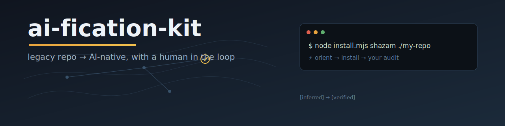
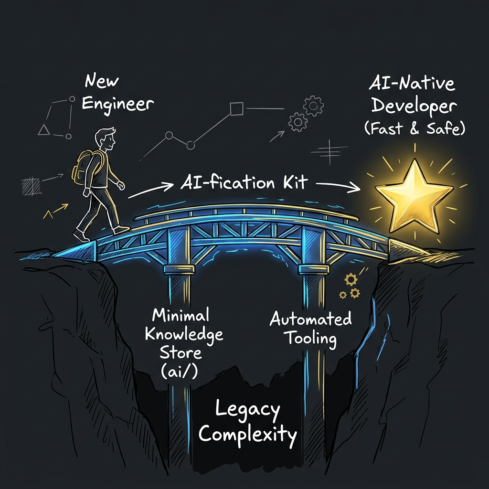
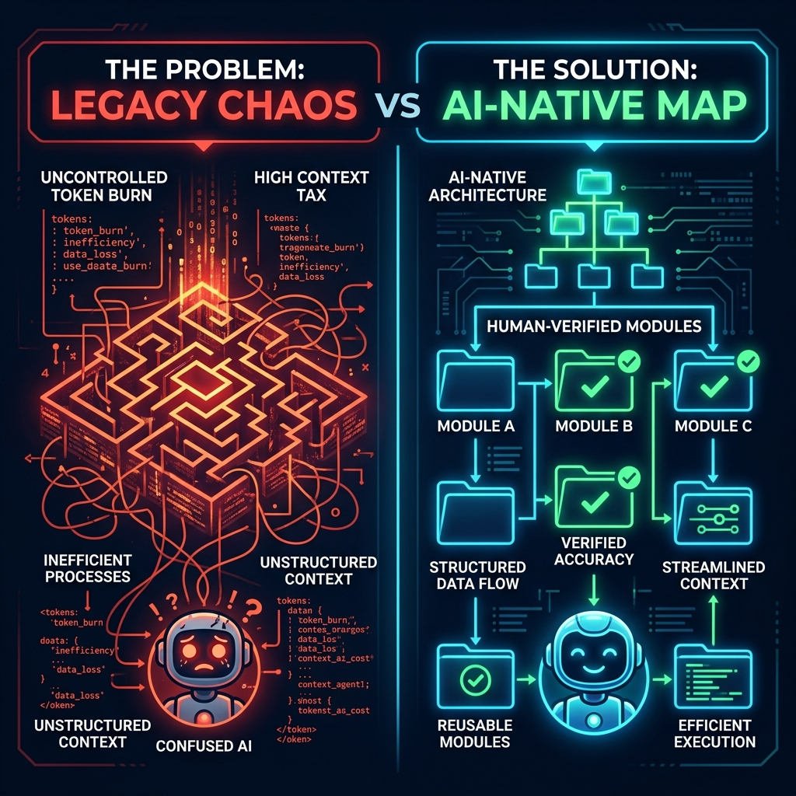
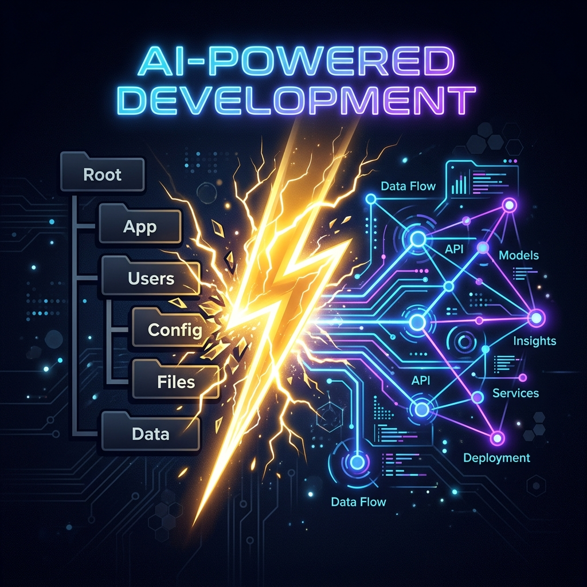
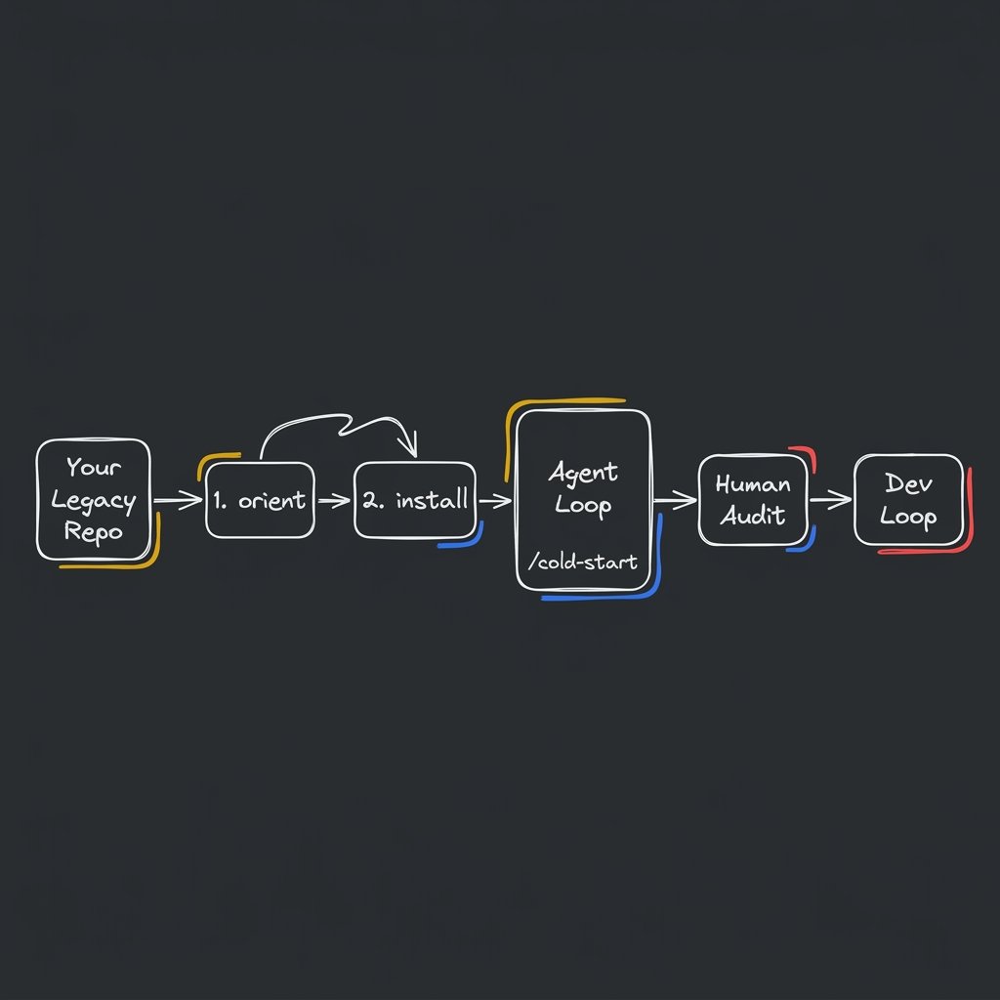
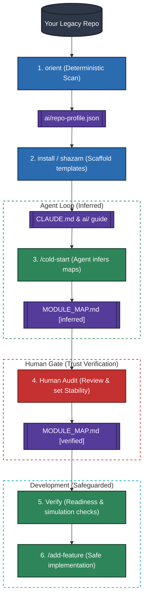
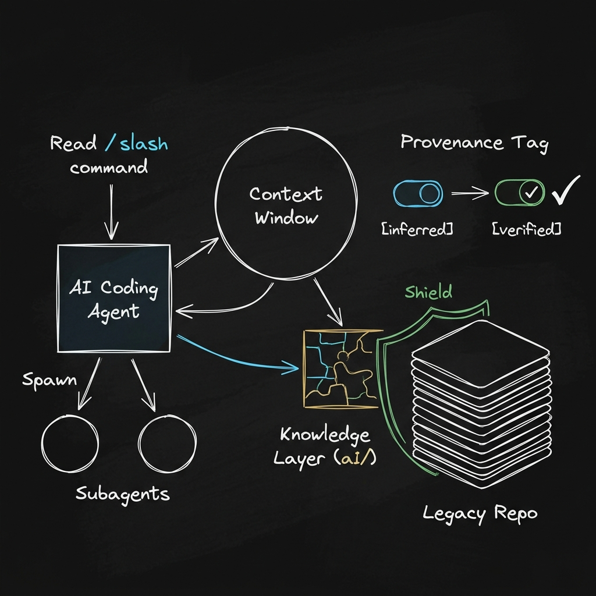

<!-- Copyright (c) 2026 CEA LIST / Kunal Suri. All rights reserved. -->

<div align="center">



<br><br>

[](LICENSE)
[](install.mjs)
[](install.py)
[](https://claude.ai/code)
[](docs/FAQ.md#what-do-cursor--copilot--codex-users-actually-get)
[](https://github.com/kunalsuri/ai-fication-kit/actions/workflows/test.yml)

<!-- After the first Zenodo release, add:
[](https://doi.org/10.5281/zenodo.XXXXXXX)
-->

</div>

---

**A Toolkit to Give AI Coding Agents a Trusted Map of Any Existing/Legacy Repo**

* Drafted by AI Agents, **verified by Humans**, and kept mechanically honest. 

* One command scaffolds it, and depending on the complexity of the codebase, it can be made trustworthy in **30 minutes to a few hours**.

---

## 🌉 The Bridge to AI-Native Onboarding

<p align="center">
  
</p>

For engineers onboarding onto a complex codebase, the learning curve is historically steep. AI coding agents can accelerate this transition, but they get lost without a reliable map. 

This kit acts as a **bridge**: combining a **minimal knowledge store** (the `ai/` folder) with **automated tooling** to help developers and AI agents collaborate safely. It is designed to help engineers adapt and become AI-native very fast.

---

## The Problem & The Solution

<p align="center">
  
</p>

### 🛑 The Problem: The Agent Context Tax

AI coding agents (such as Claude Code, Cursor, Copilot) are highly capable, but they are **context-blind** on large or legacy repositories.

* **Token Burn:** They re-read the directory tree every session.
* **Guesswork:** They guess which files are safe to modify, burning through your context windows.
* **Dangerous Hallucinations:** An agent-hallucinated map is worse than no map: the agent will confidently edit the wrong module.

### 🛡️ The Solution: A Provenance-Tracked Map

The answer isn't to rewrite your code. It's to give the agent a **provenance-tracked map** where every claim must be validated by you:

* **`[inferred]`** ➔ Scaffolds and maps drafted by the AI agent or installer.
* **`[verified]`** ➔ Human-checked and confirmed repository facts.
* 🚫 **Strict Security:** AI agents are forbidden from marking their own drafts as `[verified]`. The flip is your signature.

---

## ⚡ The Magic of "Shazam"

<p align="center">
  
</p>

Amidst the endless noise around AI, it is easy to get lost. Many developers and teams want to adopt AI coding agents but don't know how to adapt their repositories safely. 

We packaged our workspace intelligence to give you that transformation power in a single command—like magic. 

Running `shazam` instantly turns any legacy repository into a structured, AI-native development space.

```bash
node install.mjs shazam /path/to/your/repo     # ⚡ orient → install → your audit
```

---

## How It Works

<p align="center">
  
</p>

<details>
<summary>📊 Expand to view the detailed Mermaid code & workflow diagram source</summary>


</details>

### The 6-Step Workflow

| Step                        | Owner              | Description                                                                                                                                                                                                      |
|:--------------------------- |:------------------ |:---------------------------------------------------------------------------------------------------------------------------------------------------------------------------------------------------------------- |
| **1️⃣ `orient`**            | Script (Seconds)   | **Deterministic observation.** Reads marker files (`package.json`, `pom.xml`, `pyproject.toml`, etc.) and writes `ai/repo-profile.json` (languages, build/test commands, fork status). No LLM. Nothing executed. |
| **2️⃣ `install`**           | Script (Seconds)   | **Scaffolding.** Stamps the templates into your repository. Records every written file in an install manifest so `uninstall` can perform a clean removal.                                                        |
| **3️⃣ `/cold-start`**       | Agent (~5 Mins)    | **Model inference.** Drafts `MODULE_MAP.md`, diagrams, and candidate features. Every claim is tagged `[inferred]` with a checklist at the end.                                                                   |
| **4️⃣ Your Audit**          | **You** (~30 Mins) | **The trust verification.** Review the map, set module stability (`frozen` / `stable` / `ours` / `?`), and flip confirmed rows to `[verified]`.                                                                        |
| **5️⃣ Verify** *(Optional)* | Script + Agent     | **Stability checks.** `verify` (script, no LLM) mechanically cross-checks every file-path claim in the docs against the real tree → `VERIFICATION_MANIFEST.json` + report. Then `/post-cold-start-verification` (semantic gap report), `/verify-ai-readiness` (maturity rating), or `/perform-feature-add-simulation` (simulated friction check). |
| **6️⃣ `/add-feature`**      | Agent              | **Safeguarded development.** The agent builds specs, navigates using the maps, runs tests, and updates the knowledge layer without touching frozen code.                                                         |

> [!NOTE]
> The name `shazam` is inspired by the magic word: the idea is to transform a legacy repository into an AI-native repository with a single command.

---

## Quick Start

Get up and running in under five minutes.

### 1️⃣ Run the Scaffolder

Select one of the options below depending on your stack and preferences:

#### Option A: Direct via `npx` (No Clone Required, JS/TS Developers)

Run the installer directly using `npx` against the GitHub repository:

```bash
# 1 · Preview the installation (writes nothing, dry-run)
npx github:kunalsuri/ai-fication-kit shazam /path/to/your/repo --dry-run

# 2 · Run the live installation
npx github:kunalsuri/ai-fication-kit shazam /path/to/your/repo
```

> [!NOTE]
> *Future publishing note:* We plan to publish this kit to the public npm registry. Once published, you'll be able to run `npx ai-fication-kit shazam /path/to/your/repo` directly.

#### Option B: Local Clone (Node.js or Python Developers)

Clone the repository and run the scripts locally (pure Node.js or Python stdlib):

```bash
# Clone the repository
git clone https://github.com/kunalsuri/ai-fication-kit.git
cd ai-fication-kit

# Run with Node.js
node install.mjs shazam /path/to/your/repo

# OR run with Python (pure stdlib, no external dependencies)
python install.py shazam /path/to/your/repo
```

---

### 2️⃣ Initialize Agent Maps

Open your target repository in **Claude Code** (or your agent of choice) and run:

```bash
/cold-start
```

*This command runs for ~5 minutes as the agent scans the code and drafts the initial map.*

---

### 3️⃣ Conduct Your Human Audit

Open `ai/guide/MODULE_MAP.md` to review the generated draft:

1. Define each module's **Stability** (`frozen` / `stable` / `ours` / `?`).
2. Mark verified entries as `[verified]`.
3. Keep the docs mechanically honest — at any time, cross-check every file-path
   claim in the maps against the real tree (deterministic, no LLM):

```bash
node install.mjs verify /path/to/your/repo        # or: python install.py verify ...
# writes ai/analysis/audit-reports/VERIFICATION_MANIFEST.json + a readable report
# add --strict to fail (exit 1) on stale claims, e.g. in CI
```

Need to adjust options? Override them: `--name`, `--build`, `--test`, `--upstream`. 
Changed your mind? Cleanly remove everything:

```bash
node install.mjs uninstall /path/to/your/repo
```

> [!TIP]
> The audit is the step that makes everything else trustworthy. See [docs/AUDIT-GUIDE.md](docs/AUDIT-GUIDE.md) for a step-by-step walkthrough, and [docs/FAQ.md](docs/FAQ.md) for answers to common questions.

---

## What You Get

This kit scaffolds a minimal, highly structured knowledge directory inside your target repository:

```
your-repo/
├── CLAUDE.md                ← auto-loaded by Claude Code (thin; points everywhere else)
├── AGENTS.md                ← same rules for Cursor, Copilot, Codex, Windsurf
├── ai/
│   ├── INDEX.md             ← role → path manifest (prompts reference roles, not paths)
│   ├── repo-profile.json    ← machine-readable facts from orient (deterministic)
│   ├── install-manifest.json← what the installer wrote (for clean uninstall)
│   ├── guide/               ← navigation, loaded every session
│   │   ├── MODULE_MAP.md    ← directory → responsibility → Stability  ← START HERE
│   │   ├── PROJECT_OVERVIEW.md · ARCHITECTURE.md · FEATURE_MAP.md · CONVENTIONS.md
│   ├── analysis/            ← generated artifacts, loaded on demand
│   │   ├── FEATURE_CATALOG.md   ← feature → files index (+ _BACKEND/_FRONTEND splits)
│   │   ├── diagrams/        ← Mermaid; regenerate, don't hand-maintain
│   │   ├── audit-reports/   ← verification & readiness reports
│   │   └── problems/        ← dated analyses of specific issues
│   └── lab/                 ← development intelligence: specs/, decisions/ (ADRs),
│                              evaluations/, experiments/
└── .claude/                 ← commands (/cold-start, /add-feature, …),
                               subagents (repo-explorer, feature-builder, test-runner),
                               and the add-feature skill
```

### Directory Structure Highlights:

* **Root Guides ([CLAUDE.md](CLAUDE.md) / [AGENTS.md](AGENTS.md)):** Thin root files that point the agent to the `ai/` folder.
* **Knowledge Guide (`ai/guide/`):** Core maps (`MODULE_MAP.md` is your starting point!), conventions, and architectural overviews loaded by the agent every session.
* **Analysis Outputs (`ai/analysis/`):** Deep analytical results generated by the agent (e.g. diagrams, feature catalogs, and problems logs).
* **Lab Space (`ai/lab/`):** A dedicated area for specifications (RFCs), architecture decision records (ADRs), and evaluations.
* **Agent Operations (`.claude/`):** Reusable slash commands, helper subagents (`repo-explorer`, `feature-builder`, `test-runner`), and custom agent skills.

---

## New to AI Coding Agents? Start Here

<p align="center">
  
</p>

If slash commands and "context windows" are new to you, here is a quick terminology orientation:

🤖 **AI Coding Agent**
An autonomous assistant (like Claude Code, Cursor, or Copilot) that goes beyond simple autocomplete. It can read files, execute terminal commands, and perform edits across your codebase.

💻 **Claude Code**
Anthropic's command-line coding agent. In the Claude Code interface, commands are prefixed with a slash (like `/cold-start` or `/add-feature`).

🧠 **Context Window & Tokens**
The active working memory of an AI agent. Because large codebases easily overwhelm this memory, this kit builds a compact `ai/` directory map so the agent reads key maps instead of crawling the entire project.

🏷️ **Provenance Tagging**
The trust boundaries of the repository:
* **`[inferred]`**: Scaffolding and drafts generated automatically by the AI agent.
* **`[verified]`**: Human-checked, finalized files. AI agents are structurally restricted from modifying verified code.

👥 **Subagents**
Helper assistant processes (`repo-explorer`, `feature-builder`, `test-runner`) spawned by the main agent to perform specific, isolated tasks.


### Using Cursor, Copilot, or Codex instead of Claude Code?

Those tools read `AGENTS.md` (the rules and the knowledge map), but slash commands and subagents are Claude Code-specific. With other tools, you drive the workflow by hand — e.g. paste the contents of `.claude/commands/cold-start.md` as a prompt to run the cold-start pass.

---

## Security & Trust Guarantees

We designed the installer to be lightweight and safe:

* 🪶 **Zero Dependencies** – Node stdlib / Python stdlib only. No external npm packages.
* 🔒 **No Network or Execution** – It only copies and stamps text files. No remote API calls or arbitrary code runs.
* 🛡️ **Safe Scoping** – It only writes files inside your target directory.
* 🔍 **Dry-Run Support** – Run with `--dry-run` to see exactly what files will be created before writing anything.
* 🧹 **Clean Removal** – The installer writes `ai/install-manifest.json`. The `uninstall` command reads it to remove exactly what was written, leaving no trace.

*For more details, read both installers or refer to [SECURITY.md](SECURITY.md).*

---

## How This ToolKit Differs

While other tools scaffold files or evaluate repositories, this kit focuses on **trust through provenance, with the human as the authority**:

| Design Pillar                              | How We Implement It                                                                                                           |
|:------------------------------------------ |:----------------------------------------------------------------------------------------------------------------------------- |
| **Deterministic Scan vs. Model Inference** | A strict separation between deterministic environment checks (`orient`) and model generation (`/cold-start`).                 |
| **Provenance Tracking**                    | The strict `[inferred]` ➔ `[verified]` progression ensures you always know what has been human-checked.                       |
| **Fork-Aware Stability**                   | Classified stability markers (`frozen` / `stable` / `ours` / `?`) prevent the agent from touching upstream or legacy modules. |
| **Active Verification**                    | The `verify` command deterministically cross-checks every file-path claim in the knowledge docs against the source tree (manifest + report, no LLM); agent workflows then cover the semantic checks a script cannot judge. |

---

## License

[Apache 2.0](LICENSE) © 2026 Kunal Suri (CEA LIST).
