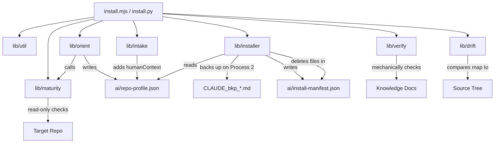

<!-- Copyright (c) 2026 CEA LIST / Kunal Suri. All rights reserved. -->
# Codebase Functionality & API Guide

This document provides a concise reference to the internal modules and functions of the **ai-fication-kit**. It is designed for developers who want to understand the codebase structure or extend its capabilities.

---

## 1. System Architecture Overview

The toolkit is designed to be **dual-runtime** and **behavior-identical** between Node.js (`.mjs`) and Python (`.py`). 
- There are no third-party dependencies in either runtime.
- The command-line scripts act as minimal wrappers that parse arguments and delegate to the `lib/` modules.
- State is passed strictly via filesystem documents (`repo-profile.json` and `install-manifest.json`).

---

## 2. CLI Entry Points

### `install.mjs` / `install.py`
These entry points parse CLI flags and target directories, check the target path validity, and route commands to their respective implementations:

| Command | Action | Key Invocation |
| :--- | :--- | :--- |
| **`orient`** | Detects repository stacks and generates profile. | Calls `orient()` and writes `ai/repo-profile.json`. |
| **`install`** | Stamped templates with profile info. | Calls `install()` using either existing or fresh profile. |
| **`shazam`** | One-shot interactive onboarding. | Runs maturity check, `orient()`, `runFirstRunWizard()`, then `install()` with process-aware backup. |
| **`uninstall`**| Clean removal of stamped templates. | Calls `uninstall()` using `ai/install-manifest.json`. Reports backup file locations. |
| **`verify`** | Mechanical path claims validation. | Calls `verify()` scanning markdown files against the disk. |
| **`drift`** | Reports where the code has outgrown the map. | Calls `drift()` comparing `MODULE_MAP.md` to the tree (`--git` adds the stale check). |
| **`check-repo-maturity`** | Read-only AI readiness diagnostic. | Calls `checkMaturity()`, prints report, writes `MATURITY_REPORT.json`. No LLM, no code changes. |

---

## 3. Module reference

### `lib/util`
Shared file system wrappers, user prompts, and static constants.

#### Constants
- `KIT_VERSION` (`"0.1.0"`): Package version.
- `PROFILE_REL` (`"ai/repo-profile.json"`): Profile path.
- `MANIFEST_REL` (`"ai/install-manifest.json"`): Manifest path.
- `KIT_FOOTER_MARKER` (`"<!-- Installed by ai-fication-kit"`): Marker used to detect kit-generated files vs user-authored ones.

#### Functions
- **`backupName(base, ext)`** / **`backup_name(base, ext)`**
  Generates a timestamped backup filename (e.g. `CLAUDE_bkp_20260617_221847.md`). Used by Process 2 installer flow.
- **`die(msg)`**
  Prints an error message to `stderr` prefixed with `✗` and terminates the process with exit code 1.
- **`confirm(question, flags)`**
  Prompts the user for a y/N answer. Automatically returns `true` if the `--yes` flag is specified.
- **`isInteractive()`**
  Checks whether the current environment has TTY streams attached (detects CI or automated scripts).
- **`ask(question, flags, fallback)`**
  Prompts the user for free-text input. Returns the `fallback` value if automated or left empty.
- **`choose(question, options, flags, defaultIndex)`**
  Displays a numbered list of choices to prompt single-choice selection. Returns the chosen string.
- **`exists(p)`** / **`isDir(p)`** / **`isFile(p)`** / **`readText(p)`** *(Node.js only)*
  Utility functions wrapping `node:fs/promises` for safe, exception-free filesystem inspections.

---

### `lib/orient`
Responsible for analyzing files in a project root directory to compile language, build, and test settings.

#### Constants
- `DETECTORS`: A static lookup array containing file markers (e.g. `package.json`, `pom.xml`, `requirements.txt`) and their corresponding default commands/languages.
- `TEST_DIR_CANDIDATES`: Array of folders scanned for test detection (e.g. `test/`, `tests/`, `spec/`).

#### Functions
- **`detectFork(targetAbs, flags)`** / **`detect_fork(target, flags)`**
  Parses the `.git/config` file to check if a remote named `upstream` exists.
- **`detectDescription(targetAbs, flags)`** / **`detect_description(target, flags)`**
  Extracts the first representative text line from `README` files to guess the project's description.
- **`orient(targetAbs, flags)`** / **`orient(target, flags)`**
  Runs the maturity check first, then iterates through `DETECTORS` to match files on disk, applies refinements (like TypeScript detection via `tsconfig.json` or Poetry package management), and returns the parsed profile object with embedded maturity data (`maturity.process`, `maturity.score`, `maturity.level`, `existingAIConfig`).
- **`printProfile(profile)`** / **`print_profile(p)`**
  Prints the structured orientation findings to stdout in a clean, human-readable format.

---

### `lib/maturity` *(NEW)*
Deterministic, read-only AI readiness assessment. Every check is a file-existence or file-content test — nothing is executed and nothing is written to disk. The output drives the Process 1 (legacy) vs Process 2 (modern) decision gate.

#### Functions
- **`checkMaturity(targetAbs)`** / **`check_maturity(target)`**
  Runs 11 deterministic checks (AI config, version control, build system, test infra, CI/CD, documentation, dependency locks, code structure, license, security, gitignore). Returns a result dict with `score` (0-100), `level` (Minimal/Early/Developing/Mature), `process` (1 or 2), and `existingAIConfig`.
- **`printMaturityReport(result)`** / **`print_maturity_report(result)`**
  Pretty-prints a formatted maturity report to the console with a visual score bar, check-by-check results, and process summary.

---

### `lib/installer`
Handles copying templates, replacing variables, and cleanly deleting generated files.

#### Functions
- **`placeholders(profile)`**
  Generates variable substitution maps (e.g., `PROJECT_NAME`, `BUILD_CMD`, `FORK_RULE`) from the project profile.
- **`stamp(text, vars)`**
  Replaces all double-curly brace placeholders `{{VARIABLE}}` in templates, returning the modified string and any remaining unresolved tokens.
- **`listTemplateFiles()`** / **`list_template_files()`**
  Recursively collects all files under the `templates/` directory, throwing an error if a symbolic link is encountered.
- **`destinationFor(rel)`** / **`destination_for(rel)`**
  Maps relative template paths to their target locations, renaming the `claude/` directory prefix to `.claude/` and removing `.tmpl` suffixes.
- **`install(targetAbs, profile, flags)`** / **`install(target, profile, flags)`**
  On Process 2 repos, first backs up user-authored `CLAUDE.md`/`AGENTS.md` with timestamped names (e.g. `CLAUDE_bkp_20260617_221847.md`). Then executes variable replacement on template files, writes them to the target folder (force-overwriting backed-up files), and creates/updates `ai/install-manifest.json` with posix-normalized paths.
- **`uninstall(targetAbs, flags)`** / **`uninstall(target, flags)`**
  Deletes all files registered in `ai/install-manifest.json` after verifying they are strictly inside the target path (as a security safeguard), removes empty parent directories, and reports any backup files that were preserved with their full paths.

---

### `lib/intake`
Conducts the interactive onboarding questionnaire.

#### Functions
- **`detectBranch(targetAbs)`** / **`detect_branch(target)`**
  Inspects `.git/HEAD` to extract the current git branch name without shelling out to external Git binaries.
- **`runFirstRunWizard(targetAbs, profile, flags)`** / **`run_first_run_wizard(target, profile, flags)`**
  Guides the developer through interactive questions covering skill maturity, branch warnings, and repository organization. For Process 2 repos, also explains the backup-and-install flow and asks for confirmation. Returns the populated `humanContext` object.

---

### `lib/verify`
Provides deterministic claim verification to keep documentation and code-structures in sync.

#### Constants
- `VERIFY_IGNORED_DIRS`: Directives to skip heavy directories (e.g. `node_modules`, `.git`, `dist`).
- `VERIFY_NON_FILES`: Commonly code-quoted idioms excluded from verification (e.g. `module.exports`, `process.env`).

#### Functions
- **`extractClaims(text, sourceFile)`** / **`extract_claims(text, source_file)`**
  Extracts backtick-wrapped path claims from input text, ignoring URLs, bash commands, and variables.
- **`buildFileIndex(root)`** / **`build_file_index(root)`**
  Performs a single traverse of the target directory tree, creating lowercased path-to-file and name-to-path mappings.
- **`verify(targetAbs, flags)`** / **`verify(target, flags)`**
  Cross-references extracted claims against the file tree index, counts results (`confirmed`, `moved`, `missing`), and writes `VERIFICATION_MANIFEST.json` and `VERIFICATION_REPORT.md`.

---

### `lib/drift`
The reverse of `verify`: where has the repository moved away from the knowledge layer?
Structural checks are pure file inspection (no execution); the optional `--git` stale
check shells out to a local, read-only `git`.

#### Constants
- `DRIFT_IGNORED_DIRS`: Directories never crawled or flagged (build output, tooling, and the kit's own `ai/` and `.claude/`).
- `SOURCE_EXTS`: File extensions that make a directory "code-bearing" (so docs-only/config-only directories are not reported as unmapped).

#### Functions
- **`parseModuleMap(text)`** / **`_parse_module_map(text)`**
  Parses the `MODULE_MAP.md` table into rows (directory + entry-point claims, provenance status) and reads the last-verified commit SHA.
- **`hasSourceFile(dirAbs)`** / **`_has_source_file(dir_abs)`**
  Recursively answers whether a directory contains any source file (stops early).
- **`drift(targetAbs, flags)`** / **`drift(target, flags)`**
  Reports `unmapped` (code-bearing directories no row covers), `vanished` (quoted directories/entry points that are gone), and — with `--git` — `stale` (`[verified]` rows whose code changed since the verified commit). Writes `DRIFT_MANIFEST.json` and `DRIFT_REPORT.md`; `--strict` exits non-zero on any drift.
