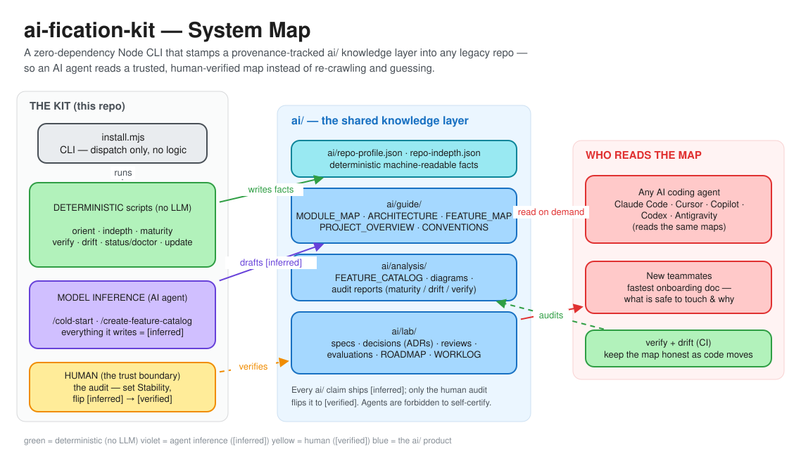
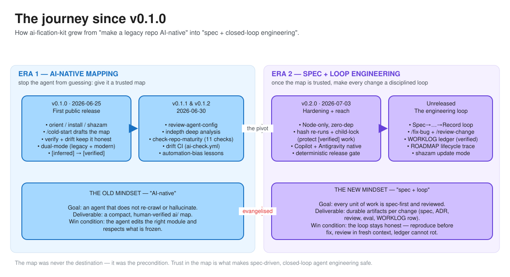
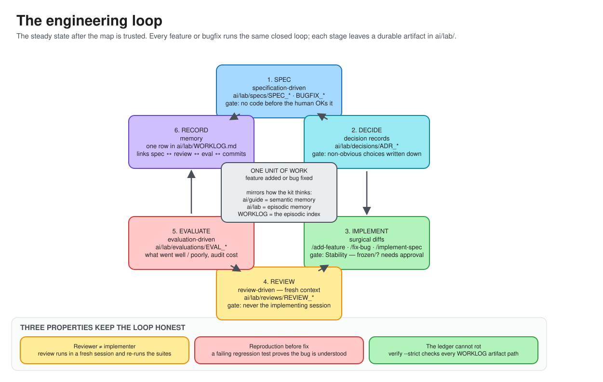

<!-- Copyright (c) 2026 Kunal Suri (CEA LIST). All rights reserved. -->
# docs/diagrams — the big-picture map of the kit

Three hand-editable **Excalidraw** diagrams that answer, in one glance each:

1. **What is this codebase and what does it do?** — the moving parts and how they fit.
2. **How did we get here?** — the journey from *AI-native mapping* to *spec + loop engineering*.
3. **What is the daily discipline now?** — the closed engineering loop the method settled on.

These are the wide-angle companions to the precise, code-level
[system-diagrams/](../system-diagrams/README.md) (Use Case / Class / Sequence /
State views). Start here for the story; go there for the mechanics.

> **Status:** `[inferred]` — drafted by an agent on 2026-07-05 from the repo's own
> guides (`docs/METHODOLOGY.md`, `ai/guide/`, `CHANGELOG.md`). A human should audit
> the framing before treating it as `[verified]`.

---

## 1 · System map — what the kit *is*

`ai-fication-kit` is a zero-dependency Node CLI that stamps a provenance-tracked
`ai/` knowledge layer into any legacy repo. Three producers write into that layer —
**deterministic scripts** (no LLM), the **AI agent** (everything tagged
`[inferred]`), and the **human** (the audit that flips claims to `[verified]`) — and
every agent and teammate then reads the same trusted map.



## 2 · The journey — AI-native → spec + loop engineering

The kit began (v0.1.0) as a way to stop an agent from re-crawling and hallucinating:
give it a trusted map. Once that map could be trusted, the emphasis shifted to making
every *change* disciplined — spec-first, reviewed in fresh context, recorded in a
ledger that cannot rot. The map was never the destination; it was the precondition.



## 3 · The engineering loop — the steady state

After a repo is AI-native, every unit of work (a feature or a bugfix) runs the same
closed loop, and each stage leaves a durable artifact in `ai/lab/`.



---

## Viewing & editing

The **`.excalidraw` files are the editable source of truth** — open them in either:

- **[excalidraw.com](https://excalidraw.com)** → *Open* → pick the `.excalidraw` file, or
- **VS Code** with the *Excalidraw* extension (`pomdtr.excalidraw-editor`) — just
  click the file.

The **`.svg` files** are auto-generated previews so the diagrams render in GitHub and
any browser without Excalidraw. **Do not hand-edit the SVGs** — they are overwritten
on every regeneration.

### Regenerating

`generate.mjs` builds all three `.excalidraw` scenes *and* their `.svg` previews
deterministically (fixed seeds and timestamp, so a content change produces a small,
readable git diff):

```sh
node docs/diagrams/generate.mjs
```

Two ways to keep these current as the codebase changes — pick one and stay consistent:

- **Edit the `.excalidraw` visually** (excalidraw.com / VS Code), then regenerate the
  SVG preview *from the edited scene* — or just commit a fresh SVG export from
  Excalidraw. If you go this route, treat the `.excalidraw` as canonical and know that
  re-running `generate.mjs` would overwrite your visual edits.
- **Edit `generate.mjs`** (the layout is plain data — boxes, arrows, labels) and
  re-run it. Best when the *content* changes (a new command, a new era, a new loop
  stage) rather than the visual polish.

| File | Role |
|---|---|
| `01-system-map.excalidraw` · `.svg` | What the kit is and does |
| `02-evolution-journey.excalidraw` · `.svg` | v0.1.0 → now: the mindset shift |
| `03-engineering-loop.excalidraw` · `.svg` | The steady-state development loop |
| `generate.mjs` | Deterministic generator for all of the above |
