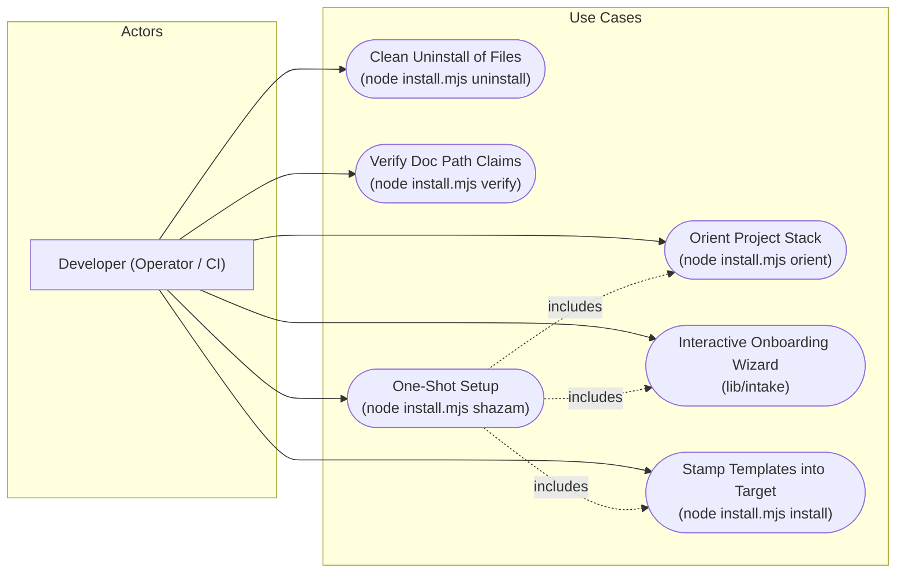
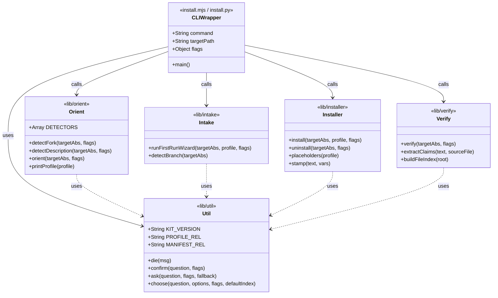
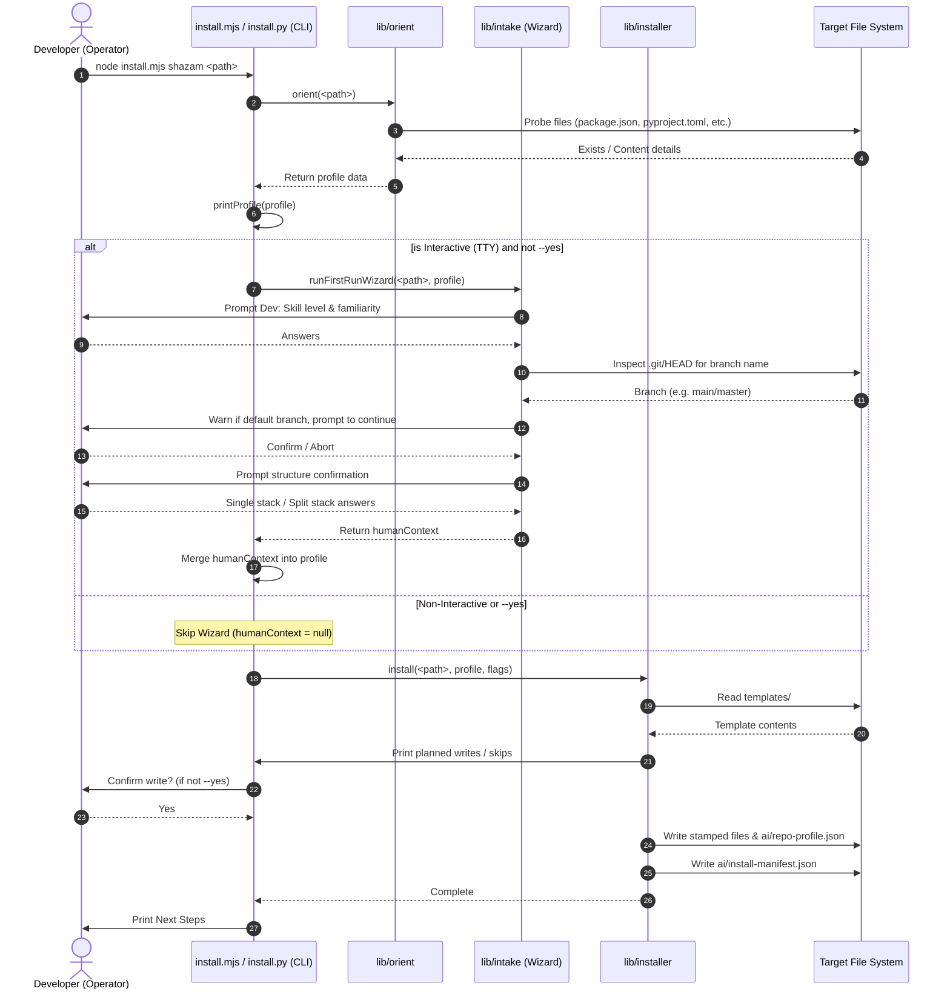

<!-- Copyright (c) 2026 CEA LIST / Kunal Suri. All rights reserved. -->
# System Engineering Diagrams

This document contains Mermaid-based system engineering diagrams to help developers quickly understand the operations, components, interactions, and lifecycles in the **ai-fication-kit**.

---

## 1. Use Case Diagram

The Use Case diagram outlines how a developer or automated process (like CI) interacts with the system using different CLI commands, and how the `shazam` one-shot command integrates orient, intake, and install steps.

---

## 2. Class / Module Diagram

The Class/Module diagram represents the layout of the code modules, the data schemas passed between them, and the logical dependencies of the Node.js and Python runtimes.

---

## 3. Sequence Diagram (`shazam` workflow)

The Sequence diagram traces the step-by-step control flow and interactions between modules when running the interactive `shazam` setup.

---
