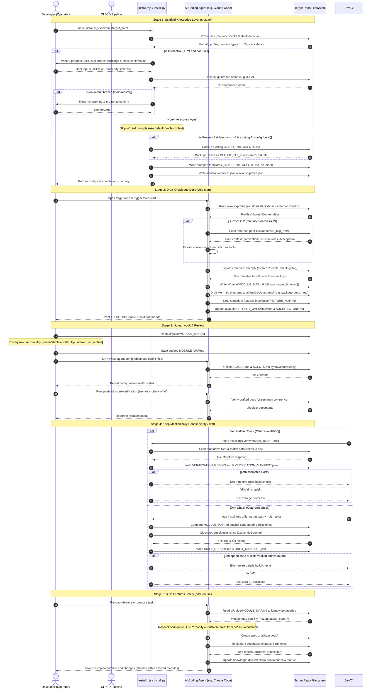

<!-- Copyright (c) 2026 Kunal Suri (CEA LIST). All rights reserved. -->
# End-to-End User Lifecycle & Developer Workflow

This document describes the complete lifecycle of a repository using the **ai-fication-kit**. It maps out the interactions between the **Developer**, the **CI/CD Pipeline**, the **Toolkit CLI**, the **AI Coding Agent** (e.g., Claude Code, Cursor), and the **Target Repository File System**.

---

## 1. Sequence Diagram

The following diagram traces the 5 core stages of onboarding and using the kit:
1. **Scaffold (`shazam`)**: Initialize the target codebase and generate core AI configuration.
2. **Draft (`/cold-start`)**: The AI Agent scans the repository and drafts the initial knowledge base.
3. **Audit**: The Developer reviews and signs off on the generated files, establishing safety boundaries.
4. **Guard/Verify**: Mechanical checks prevent documentation rot locally and in CI/CD.
5. **Leverage (`/add-feature`)**: The AI Agent safely adds features, respecting the boundaries of the audited map.

---

## 2. Step-by-Step Description

### Stage 1: Scaffold (`shazam`)
- **Action**: The developer runs `node install.mjs shazam <target_path>` to initialize the knowledge layer.
- **Maturity & Orientation**: The CLI first evaluates repository maturity and orientation:
  - Scans for indicators like Git usage, license presence, test frameworks, lockfiles, and CI/CD pipelines.
  - Detects build and test configurations to write to `ai/repo-profile.json`.
- **Interactive Wizard**: If interactive (TTY), the CLI guides the developer through onboarding questions, prompting for their familiarity with the codebase, mapping a single or split stack, and verifying that they aren't directly installing to `main`/`master` without staging.
- **Backup & Stamping**:
  - In Process 2 repositories (existing AI settings present and maturity $\ge$ 40), the tool automatically backs up existing `CLAUDE.md` and `AGENTS.md` profiles with a timestamp.
  - It stamps the templates with resolved variables and writes them to `.claude/commands/`, `CLAUDE.md`, `AGENTS.md`, and the `ai/` structure.
  - Finally, it writes `ai/install-manifest.json` to enable clean uninstalls.

### Stage 2: Draft (`/cold-start`)
- **Action**: The developer opens the codebase with an AI Coding Agent and runs the `/cold-start` command.
- **Loading Profile & Context**: The agent reads the generated `ai/repo-profile.json` to calibrate its explanations and understand the codebase stack.
- **Prior Config Assimilation**: If in a Process 2 repo, the agent scans root files for `CLAUDE_bkp_*.md` and `AGENTS_bkp_*.md`, extracting custom conventions, project descriptions, and rules, merging them into the new configuration as `[inferred — from prior config]`.
- **Codebase Exploration**: The agent maps the codebase (typically using a lightweight read-only subagent like `repo-explorer` to preserve context size).
- **Drafting the Knowledge Base**:
  - Populates `ai/guide/MODULE_MAP.md` with every code-bearing directory, marking the entry point, responsibilities, and a stability guess.
  - Drafts initial Mermaid diagrams (like `package-deps.mmd` or `seam.mmd`) under `ai/analysis/diagrams/`.
  - Maps features in `ai/guide/FEATURE_MAP.md` and updates `PROJECT_OVERVIEW.md` and `ARCHITECTURE.md`.
  - **Crucial Rule**: Every file written by the agent inside `ai/` is tagged `[inferred]`.
- **Completion**: The agent halts and prints an **AUDIT TODO** table summarizing what needs manual verification.

### Stage 3: Human Audit
- **Action**: The human developer acts as the gatekeeper.
- **Verification**: Row-by-row in `ai/guide/MODULE_MAP.md`, the developer sets the appropriate stability:
  - `ours`: Active, safe-to-edit directories.
  - `stable`: Core internal libraries that are fully complete and should rarely change.
  - `frozen`: Third-party code, legacy components, or upstream repositories that must not be modified.
  - `?`: Unverified components (treated as `frozen` by default).
- **Sign-off**: For every audited row, the developer flips `[inferred]` to `[verified] (YYYY-MM-DD)`.
- **Sanity Checks**: The developer runs `/review-agent-config` and `/post-cold-start-verification` in their agent to double-check formatting and semantic alignment.

### Stage 4: Keep Mechanically Honest
- **Action**: Deterministic scripts guard against documentation decay and codebase drift.
- **Verify**: `node install.mjs verify <target_path>` parses markdown files for backtick-quoted file/directory paths and ensures they actually exist on disk.
- **Drift**: `node install.mjs drift <target_path>` matches the directories in `MODULE_MAP.md` against the filesystem. With the `--git` flag, it checks if files in `[verified]` directories have been modified since the last verified git commit.
- **CI/CD Integration**: Adding `--strict` forces these scripts to exit with a non-zero code upon detecting errors, acting as a gate in CI pipelines to prevent merging code without updating the maps.

### Stage 5: Safe Feature Development (`/add-feature`)
- **Action**: With the maps verified, the AI agent is instructed to add a feature via `/add-feature` or a direct prompt.
- **Constraint Parsing**: The agent first reads `ai/guide/MODULE_MAP.md`.
- **Boundary Respect**: It identifies `frozen` and `?` directories and ensures they remain unmodified. Edits are isolated to `ours` or `stable` modules.
- **Execution & Integration**:
  - The agent creates a technical spec under `ai/lab/specs/`.
  - It writes code changes, runs tests, and validates that everything passes.
  - It documents the new functionality by updating the `ai/guide/` documents (e.g. `FEATURE_MAP.md`).
  - Finally, it presents surgical diffs for user review and PR submission.

---

## 3. Actors & Participants Reference

| Participant | Role / Responsibility |
| :--- | :--- |
| **Developer (Operator)** | The operator initiating setup, auditing drafted guides, and verifying code changes. |
| **CI / CD Pipeline** | Automated checks verifying documentation consistency (`verify`) and codebase drift (`drift`) in pull requests. |
| **install.mjs / install.py** | The kit's CLI, providing zero-dependency tools for scaffolding, verification, and drift detection. |
| **AI Coding Agent** | The conversational AI assistant performing exploration, bootstrapping, configuration reviews, and safe feature authoring. |
| **Target Repo Filesystem** | The repository folder containing the codebase being analyzed and "ai-fified". |
